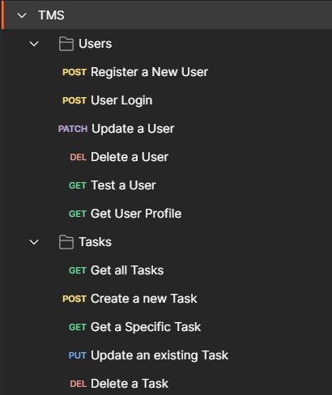

# Task Manager API

A simple Task Manager API built with Node.js, Express, and MongoDB, featuring user authentication, task management, and email notifications for task deadlines.

## Table of Contents
- [Features](#features)
- [Getting Started](#getting-started)
- [Environment Variables](#environment-variables)
- [API Endpoints](#api-endpoints)
- [Running Tests](#running-tests)
- [License](#license)

## Features
- User registration and authentication (JWT)
- Create, read, update, and delete tasks
- Email notifications for task deadlines (1 day and 1 hour before the deadline)
- Dynamic scheduling and rescheduling of email reminders

## Getting Started

### Prerequisites
- Node.js
- MongoDB

### Installation

1. Clone the repository:
    ```sh
    git clone https://github.com/sinehan001/task-management-system.git
    cd task-manager-api
    ```

2. Install dependencies:
    ```sh
    npm install
    ```

3. Create a `.env` file in the root directory and add your environment variables (see below for required variables).

4. Start the server:
    ```sh
    npm start
    ```

5. To start the server in development mode with hot-reloading:
    ```sh
    npm run dev
    ```

### Environment Variables

Create a `.env` file in the root directory and add the following variables:

```env
# Email Setup
SMTP_SERVICE=your_smtp_service_provider
SMTP_HOST=smtp.example.com
SMTP_PORT=587
SMTP_USER=your_smtp_username
SMTP_PASS=your_smtp_password

# Database Setup
MONGODB_URI=mongodb://localhost:27017/taskmanager
MONGODB_TEST_URI=mongodb://localhost:27017/taskmanager-test

# JWT Setup
JWT_SECRET=taskmanager

# Server Setup
PORT=3000
```

## API Endpoints

### Authentication

- Register a new user
   - POST /auth/v1/register
   - Request body:
   ```json 
   {
      "username": "testuser",
      "email": "testuser@gmail.com",
      "password": "testpassword"
   }
   ```
   - Response body:
   ```json 
   {
      "message": "User registered successfully"
   }
   ```

- Login a user
   - POST /auth/v1/login
   - Request body:
   ```json 
   {
      "username": "testuser",
      "password": "testpassword"
   }
   ```
   - Response body:
   ```json 
   {
      "accessToken": "your_jwt_token_here"
   }
   ```

### Users

- Test a user
   - GET /auth/v1/test
   - Response body:
   ```json 
   {
      "message": "User is authenticated"
   }
   ```

- Get user profile
   - GET /auth/v1/users
   - Request Headers: `Authorization: Bearer jwt_token_here`
   - Response body:
   ```json 
   {
      "_id": "6650a5f4d0eb103aa64f62ac",
      "username": "testuser",
      "email": "testuser@gmail.com",
      "createdAt": "24/5/2024, 8:06:36 pm",
      "updatedAt": "24/5/2024, 8:14:06 pm",
      "address": "your_address",
      "fullName": "your_full_name",
      "phone": "your_phone_number"
   }
   ```

- Update a user
   - PATCH /auth/v1/user
   - Request Headers: `Authorization: Bearer jwt_token_here`
   - Request body:
   ```json 
   {
      "email": "testuser@gmail.com",
      "password": "testpassword",
      "fullName": "your_full_name",
      "phone": "your_phone_number",
      "address": "your_address"
   }
   ```
   - Response body:
   ```json 
   {
      "_id": "6650a5f4d0eb103aa64f62ac",
      "username": "testuser",
      "email": "testuser@gmail.com",
      "createdAt": "24/5/2024, 8:06:36 pm",
      "updatedAt": "24/5/2024, 8:14:06 pm",
      "address": "your_address",
      "fullName": "your_full_name",
      "phone": "your_phone_number"
   }
   ```
- Delete a user
   - DELETE /auth/v1/user
   - Request Headers: `Authorization: Bearer jwt_token_here`
   - Response body:
   ```json 
   {
      "message": "User deleted successfully"
   }
   ```

### Tasks

- Create a new Task
   - POST /api/v1/tasks
   - Request Headers: `Authorization: Bearer jwt_token_here`
   - Request body:
   ```json
   {
      "title": "New Task",
      "description": "Task Description",
      "status": "in-progress",
      "priority": "high",
      "dueDate": "2024-05-25 18:30:00"
   }
   ```
   - Response body:
   ```json
   {
     "_id": "task_id",
     "title": "New Task",
     "description": "Task Description",
     "status": "in-progress",
     "priority": "high",
     "dueDate": "25/5/2024, 6:30:00 pm",
     "ownerId": "user_id",
     "createdAt": "23/5/2024, 10:01:20 pm",
     "updatedAt": "23/5/2024, 10:01:20 pm",
     "__v": 0
   }
   ```

- Get all tasks for the logged-in user
   - GET /api/v1/tasks
   - Response body:
   ```json
   [
      {
        "_id": "task_id",
        "title": "Task Title",
        "description": "Task Description",
        "status": "in-progress",
        "priority": "high",
        "dueDate": "25/5/2024, 6:30:00 pm",
        "ownerId": "user_id",
        "createdAt": "23/5/2024, 10:01:20 pm",
        "updatedAt": "23/5/2024, 10:01:20 pm",
        "__v": 0
      }
   ]
   ```

- Get a specific task for the logged-in user
   - GET /api/v1/tasks/`{task_id}`
   - Response body:
   ```json
   {
     "_id": "task_id",
     "title": "Task Title",
     "description": "Task Description",
     "status": "in-progress",
     "priority": "high",
     "dueDate": "25/5/2024, 6:30:00 pm",
     "ownerId": "user_id",
     "createdAt": "23/5/2024, 10:01:20 pm",
     "updatedAt": "23/5/2024, 10:01:20 pm",
     "__v": 0
   }
   ```
- Update an existing Task
   - PUT /api/v1/tasks
   - Request Headers: `Authorization: Bearer jwt_token_here`
   - Request body:
   ```json
   {
      "title": "New Task",
      "description": "Task Description",
      "status": "in-progress",
      "priority": "high",
      "dueDate": "2024-05-28 18:30:00"
   }
   ```
   - Response body:
   ```json
   {
     "_id": "task_id",
     "title": "New Task",
     "description": "Task Description",
     "status": "in-progress",
     "priority": "high",
     "dueDate": "28/5/2024, 6:30:00 pm",
     "ownerId": "user_id",
     "createdAt": "23/5/2024, 10:01:20 pm",
     "updatedAt": "24/5/2024, 4:35:20 pm",
     "__v": 0
   }
   ```

- Delete a task
   - DELETE /api/v1/tasks/`{task_id}`
   - Request Headers: `Authorization: Bearer jwt_token_here`
   - Response body:
   ```json
   {
      "message": "Task deleted successfully"
   }
   ```
## Screenshots

### Project Structure



### Users


### Tasks


## Running Tests

To run tests, run the following command

```bash
  npm test
```


## Authors

- [@sinehan001](https://www.github.com/sinehan001)


## License

This project is licensed under the [MIT](https://choosealicense.com/licenses/mit/) License.


This README file provides a clear and concise overview of the project, installation instructions, environment variables setup, API endpoints, and testing instructions. Adjust the repository URL, and any other details as needed.


